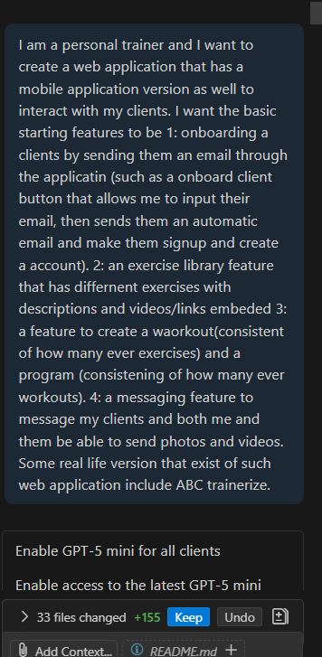
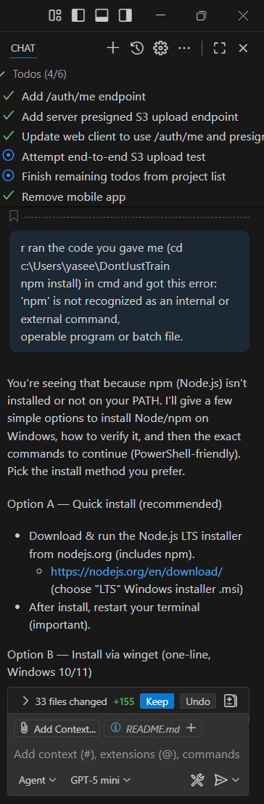
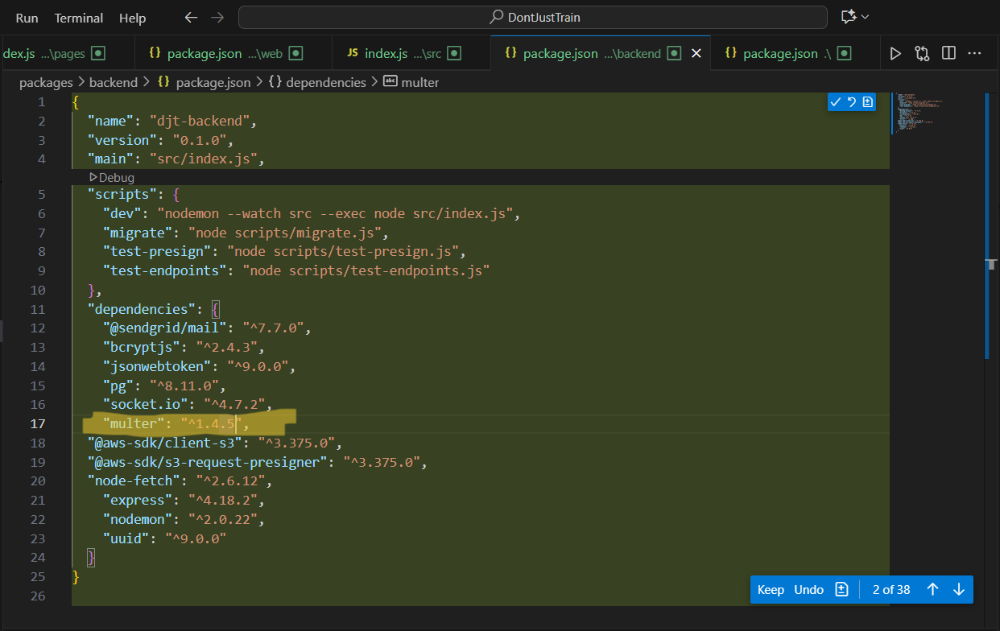
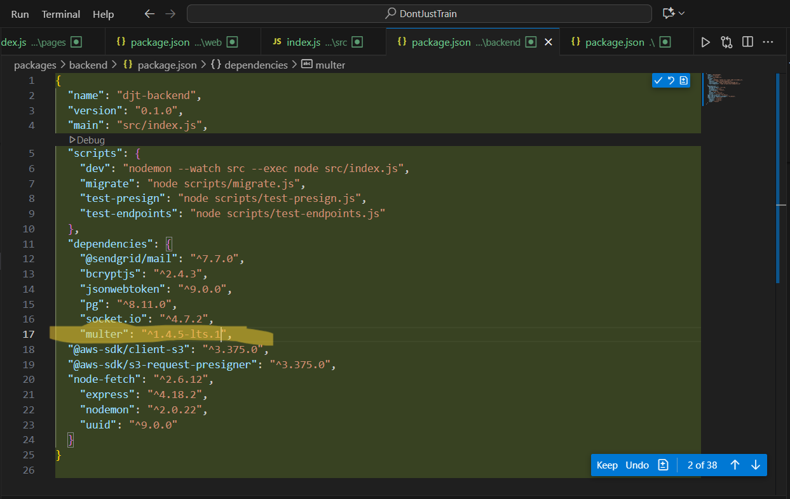
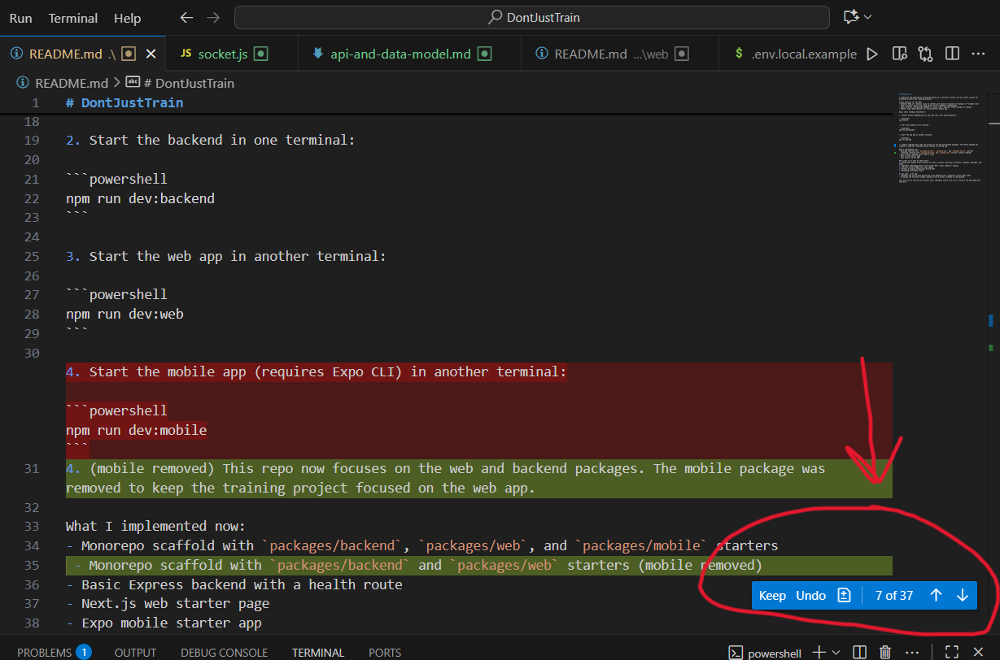

# DontJustTrain

A responsive web application connecting betwen me (a personal trainer) and my clients, mainly for assigning workouts and tracking progress. 

### Technologies Used:

1- JavaScript:  Main programming language used for both backend (server logic) and frontend (website functionality).

2- Node.js: Runtime environment, allowing JS to run outside of the browser

3- Next.js: Building the frontend of the website

4- npm (Node Package Manager): Manages project dependencies (external libraries and frameworks)

5- JSON (JavaScript Object Notation): Used in package.json to define scripts, dependencies, and project configuration

6- Socket.IO: Library for real-time communication between users and the backend (e.g., live chat feature)

7- Multer: Middleware for handling file uploads (e.g., images, documents) through the backend

8- Auth & invites: draft flow using email invites (SendGrid recommended)

9- Video hosting: YouTube/Vimeo embeds for quick start; optional cloud storage for uploads

### How to run

Prerequisites:

1- Node.js 

2- npm (comes with Node.js)

3- Git

1. Clone the repository

```cmd
git clone "Insert the URL of this repository here"
cd DontJustTrain
```

2. Install dependencies

```cmd
npm install
```

3. Setup environment variables

- Copy .env.local.example into .env.local inside the packages/web folder

- Update values as needed (e.g., API base URL, SendGrid keys, etc.)

4. Run back-end
in one terminal 

```cmd
npm run dev:backend
```
This will start the backend server on localhost:4000

5. Run front-end
in another terminal

```cmd
npm run dev:web
```

This will start the front end server on localhost:3000

6. Run the web app

In your local browser, type localhost:3000 to view the web app

### Key features

1. User Authentication & Invitations, sign up and log in using email/password.

2. Chat / Real-Time Messaging

3. Users can upload files (images, documents) using presigned URLs.

4. Program, Workout & Exercise Management

5. Video Hosting, embedded YouTube/Vimeo videos for quick start.

6. Optional cloud storage for direct uploads.

7. Responsive Web Interface

### Process images

This was my first interaction with Copilot to create the program:



I gave my error when running the app to Copilot to help me resolve it:



For other errors, I used chat GPT to chnage Copilot's initial code. This is one example with multer's version:




Keeping/Accepting changes to code from Github Copilot:



